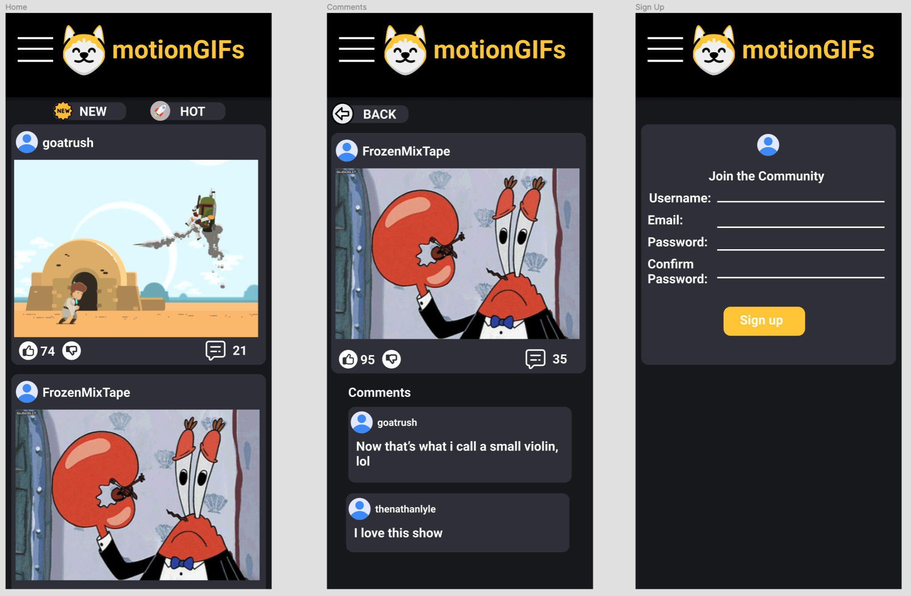
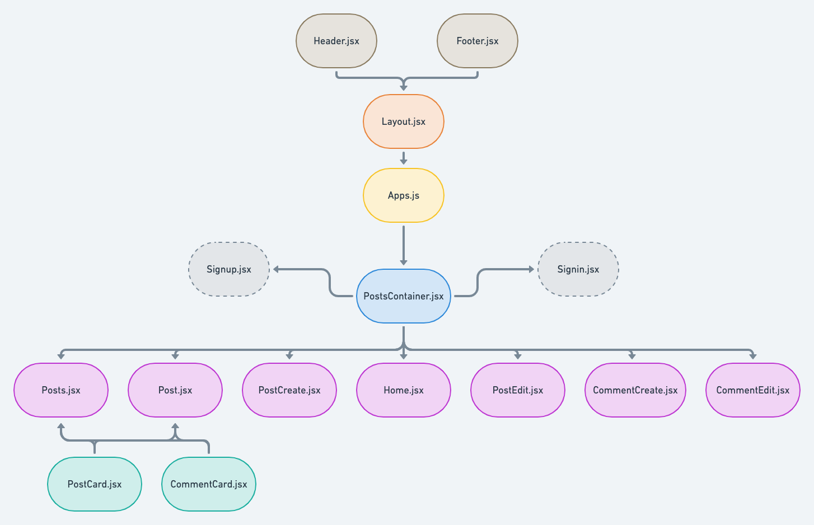
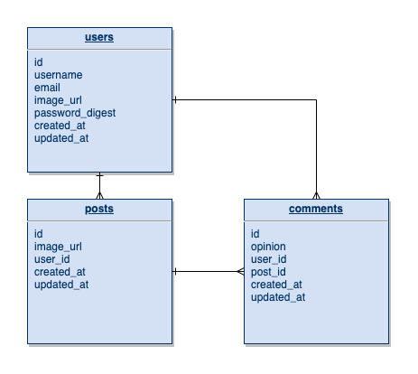

# MotionGIFs

- [Overview](#overview)
- [MVP](#mvp)
  - [Goals](#goals)
  - [Libraries and Dependencies](#libraries-and-dependencies)
  - [Client (Front End)](#client-front-end)
    - [Wireframes](#wireframes)
    - [Component Tree](#component-tree)
    - [Component Architecture](#component-architecture)
    - [Time Estimates](#time-estimates)
  - [Server (Back End)](#server-back-end)
    - [ERD Model](#erd-model)
- [Post-MVP](#post-mvp)
- [Code Showcase](#code-showcase)
- [Code Issues & Resolutions](#code-issues--resolutions)

<br>

## Overview

**MotionGIFs** is a meme displaying app where users can post gifs and interact with one another. Users are able to comment on other users posted content.

<br>

## MVP

Have a function homepage where users are able to sign in/sign up for a MotionGIFs account that receives a JWT. Users are able to view, post, edit, and delete posts and post comments. Non-users can view the site, but can't post, edit or delete.

<br>

### Goals

- _Create models, routes, and controllers for users, posts, and comments using Ruby on Rails._
- _Authentication for users and JWT creation._
- _Connect to a React front-end that displays homepage, posts, and comments._
- _Style using Material UI and vanilla CSS_
- _User Experience and mobile design priority_

<br>

### Libraries and Dependencies

|     Library      | Description                                                   |
| :--------------: | :------------------------------------------------------------ |
|      React       | _Used for front-end app_                                      |
| React Router Dom | _Route, Link, useParams, useHistory_                          |
|   Material-UI    | _Styled components and style library for front-end_           |
|      Axios       | _Make requests from front-end to Rails back-end_              |
|       Cors       | _Used to connect front-end requests to back-end server logic_ |
|      Bcrypt      | _Security to hash passwords_                                  |
|       JWT        | _Used to create JSON web tokens for users_                    |

<br>

### Client (Front End)

#### Wireframes

[MotionGIFs Wireframe Link](https://www.figma.com/file/Aram4qlCgewyO2y9AsqYUg/MotionGifs?node-id=0%3A1 "wireframe link")

- Mobile View: HOME / VIEW COMMENTS / SIGN UP



#### Component Tree

[MotionGIFs Component Tree](https://whimsical.com/5NuTVxmc7QZRhmAcy24TTs "component tree")



---

#### Component Architecture

```structure
src
|__ assets/
      |__ fonts
      |__ images
|__ helper/
      |__ sort.js
|__ components/
      |__ Header.jsx
      |__ Footer.jsx
      |__ PostCard.jsx
      |__ CommentCard.jsx
      |__ NewButton.jsx
      |__ TrendingButton.jsx
|__ services/
      |__ api-config.js
      |__ users.js
      |__ posts.js
|__ layout/
      |__ Layout.jsx
|__ screens/
      |__ Home.jsx
      |__ SignUp.jsx
      |__ SignIn.jsx
      |__ Posts.jsx
      |__ PostDetail.jsx
      |__ PostCreate.jsx
      |__ PostEdit.jsx
      |__ CommentCreate.jsx
      |__ CommentEdit.jsx
|__ containers/
      |__ PostsContainer.jsx
```

---

#### Time Estimates

| Task                            | Priority | Estimated Time | Time Invested | Actual Time |
| ------------------------------- | :------: | :------------: | :-----------: | :---------: |
| Define models                   |    H     |      2 hr      |     0 hrs     |     TBD     |
| Define controllers              |    H     |      2 hr      |     0 hrs     |     TBD     |
| Define routes                   |    H     |      3 hr      |     0 hrs     |     TBD     |
| Define screens logic            |    H     |     8 hrs      |     0 hrs     |     TBD     |
| Define component logic          |    H     |     8 hrs      |     0 hrs     |     TBD     |
| Define services logic           |    H     |     2 hrs      |     0 hrs     |     TBD     |
| Define container logic          |    H     |     3 hrs      |     0 hrs     |     TBD     |
| Define layout logic             |    H     |      2 hr      |     0 hrs     |     TBD     |
| Base CSS with MUI & Vanilla CSS |    5H    |     2 hrs      |     0 hrs     |     TBD     |
| Advanced styling                |    H     |     10 hrs     |     0 hrs     |     TBD     |
| TOTAL                           |          |     45 hrs     |     0 hrs     |     TBD     |

<br>

### Server (Back End)

#### ERD Model



<br>

---

## Post-MVP

- _Add likes, upvotes, and downvotes for comments and posts_
- _Allow users to upload profile pics and upload posts from local device_
- _Add categories to filters posts like hashtags_
- _Add sort options to search most recent and most trending posts_
- _Add user profile pages to view what individual user uploads_

---

## Code Showcase

> Use this section to include a brief code snippet of functionality that you are proud of and a brief description.

## Code Issues & Resolutions

> Use this section to list of all major issues encountered and their resolution.
